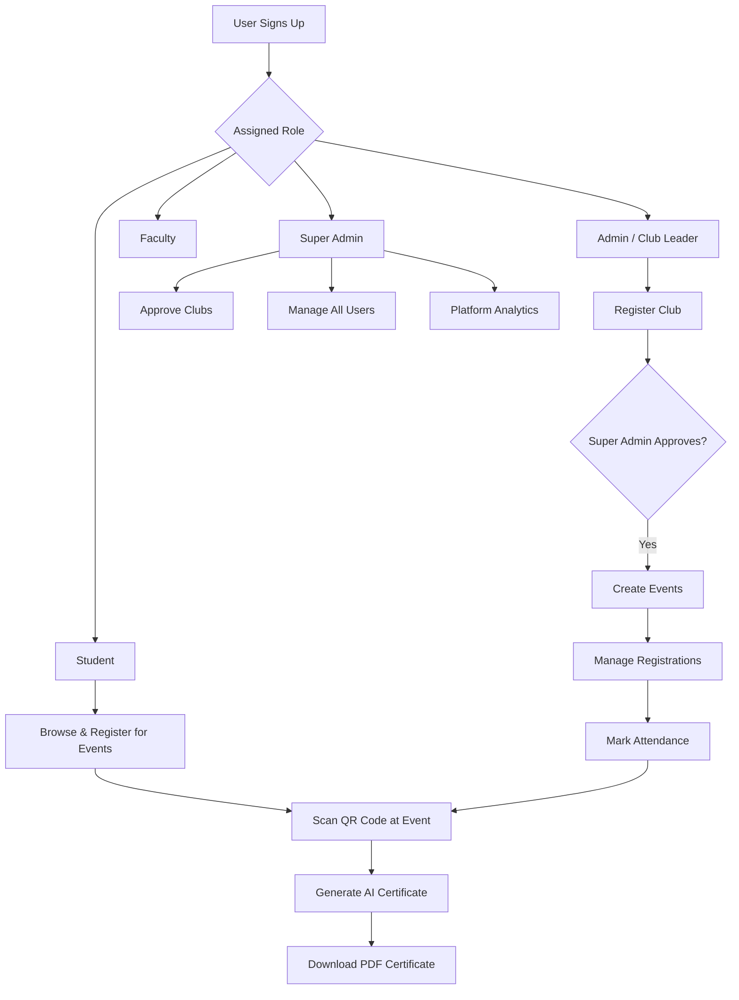

<div align="center">

# 🎓 CampusConnect

### *The Ultimate Campus Management Ecosystem*

[](https://choosealicense.com/licenses/mit/)
[](https://nodejs.org/)
[](https://reactjs.org/)
[](https://www.mongodb.com/)
[](https://vercel.com/)

**A full-stack platform connecting students, clubs, and administrators — featuring AI-generated certificates, real-time QR attendance, event management, and role-based dashboards.**

[🚀 Live Demo](#) · [📖 Documentation](#getting-started) · [🐛 Report Bug](../../issues) · [✨ Request Feature](../../issues)

---

</div>

## ✨ Key Features

<table>
<tr>
<td width="50%">

### 🏫 Multi-Role System
- **Student** — Browse events, register, scan QR, earn certificates
- **Admin (Club Leader)** — Create clubs, host events, manage registrations
- **Faculty** — Platform-wide oversight and analytics
- **Super Admin** — Full control, club approvals, user management

</td>
<td width="50%">

### 🎖️ AI Certificate Engine
- Auto-generated upon student attendance
- Unique AI-written achievement descriptions per student
- Premium PDF design with dark-themed certificate
- One-click download — no admin intervention needed

</td>
</tr>
<tr>
<td width="50%">

### 📱 QR Code Attendance
- Admin generates a time-limited QR code per event
- Students scan in-app to mark themselves present instantly
- Real-time attendance tracking dashboard

</td>
<td width="50%">

### 📊 Smart Dashboards
- Live stats: events, registrations, attendance rates
- Beautiful charts powered by Recharts
- Role-specific data views and analytics

</td>
</tr>
<tr>
<td width="50%">

### 🔔 Notification System
- In-app notifications for registration approvals/rejections
- Event updates and club announcements
- Mark-as-read with real-time badge counts

</td>
<td width="50%">

### 🔐 Authentication
- JWT-based secure login
- Google & GitHub OAuth 2.0
- Persistent sessions with refresh tokens

</td>
</tr>
</table>

---

## 🛠️ Tech Stack

<table>
<tr>
<th>Layer</th>
<th>Technology</th>
</tr>
<tr>
<td><strong>Frontend</strong></td>
<td>

React 18, Vite, React Router v7, Framer Motion, TailwindCSS, Recharts, React Query (@tanstack)

</td>
</tr>
<tr>
<td><strong>Backend</strong></td>
<td>

Node.js, Express v5, MongoDB Atlas, Mongoose, JWT, Passport.js (Google + GitHub OAuth)

</td>
</tr>
<tr>
<td><strong>Services</strong></td>
<td>

Cloudinary (image uploads), PDFKit (certificate generation), html5-qrcode, QRCode.react

</td>
</tr>
<tr>
<td><strong>Deployment</strong></td>
<td>

Vercel (Frontend + Backend), MongoDB Atlas (Database)

</td>
</tr>
</table>

---

## 📁 Project Structure

```
campusConnect/
├── client/                  # React + Vite Frontend
│   ├── src/
│   │   ├── components/      # Reusable UI components
│   │   ├── context/         # AuthContext, NotificationContext
│   │   ├── hooks/           # useApi.js (React Query hooks)
│   │   ├── pages/           # Dashboard pages per role
│   │   └── services/        # Axios API client
│   └── vercel.json          # Vercel SPA rewrite config
│
└── server/                  # Express Backend
    ├── config/              # DB & Passport config
    ├── controllers/         # Business logic
    ├── middleware/          # Auth & error middleware
    ├── models/              # Mongoose schemas
    ├── routes/              # Express route definitions
    ├── server.js            # Entry point
    └── vercel.json          # Vercel Node.js config
```

---

## 🚀 Getting Started

### Prerequisites

- [Node.js 18+](https://nodejs.org/)
- [MongoDB Atlas](https://www.mongodb.com/atlas) account
- [Cloudinary](https://cloudinary.com/) account (free tier works)

### Installation

**1. Clone the repository**
```bash
git clone https://github.com/YOUR_USERNAME/campusconnect.git
cd campusconnect
```

**2. Set up the Backend**
```bash
cd server
npm install
cp .env.example .env
# Fill in your .env values
npm run dev
```

**3. Set up the Frontend**
```bash
cd ../client
npm install
echo "VITE_API_URL=http://localhost:5000" > .env
npm run dev
```

The app will be running at **http://localhost:5173** 🎉

---

## ⚙️ Environment Variables

### Backend (`server/.env`)

| Variable | Description |
|----------|-------------|
| `MONGO_URI` | Your MongoDB Atlas connection string |
| `JWT_SECRET` | A long random secret string |
| `JWT_EXPIRE` | Token expiry (e.g. `30d`) |
| `CLOUDINARY_CLOUD_NAME` | Your Cloudinary cloud name |
| `CLOUDINARY_API_KEY` | Cloudinary API key |
| `CLOUDINARY_API_SECRET` | Cloudinary API secret |
| `GOOGLE_CLIENT_ID` | Google OAuth client ID |
| `GOOGLE_CLIENT_SECRET` | Google OAuth secret |
| `GITHUB_CLIENT_ID` | GitHub OAuth app client ID |
| `GITHUB_CLIENT_SECRET` | GitHub OAuth app secret |
| `CLIENT_URL` | Frontend URL (e.g. `https://campusconnect.vercel.app`) |
| `SESSION_SECRET` | Random session secret |

### Frontend (`client/.env`)

| Variable | Description |
|----------|-------------|
| `VITE_API_URL` | Backend API URL (e.g. `https://campusconnect-api.vercel.app`) |

---

## 🎭 User Roles & Flows



---

## 🗺️ API Endpoints (Summary)

| Method | Endpoint | Description |
|--------|----------|-------------|
| `POST` | `/api/auth/login` | Login with email/password |
| `POST` | `/api/auth/register` | Register new user |
| `GET` | `/api/events` | Get all events |
| `POST` | `/api/events` | Create new event (Admin) |
| `GET` | `/api/registrations/my` | Student's registrations |
| `PUT` | `/api/registrations/attendance/:id` | Mark attendance |
| `POST` | `/api/certificates/generate` | Generate AI certificate (Student) |
| `GET` | `/api/stats/student` | Student dashboard stats |
| `GET` | `/api/stats/admin` | Admin dashboard stats |
| `POST` | `/api/attendance/generate-qr` | Generate QR code (Admin) |
| `POST` | `/api/attendance/scan` | Scan QR to mark present (Student) |

---

## 🙌 Contributing

Contributions are welcome! Here's how:

1. **Fork** the repository
2. Create your feature branch: `git checkout -b feature/amazing-feature`
3. Commit your changes: `git commit -m 'Add amazing feature'`
4. Push to the branch: `git push origin feature/amazing-feature`
5. Open a **Pull Request**

---

## 📄 License

Distributed under the **MIT License**. See `LICENSE` for more information.

---

<div align="center">

Made with ❤️ for campus communities everywhere.

**[⭐ Star this repo](../../stargazers) if you find it useful!**

</div>
